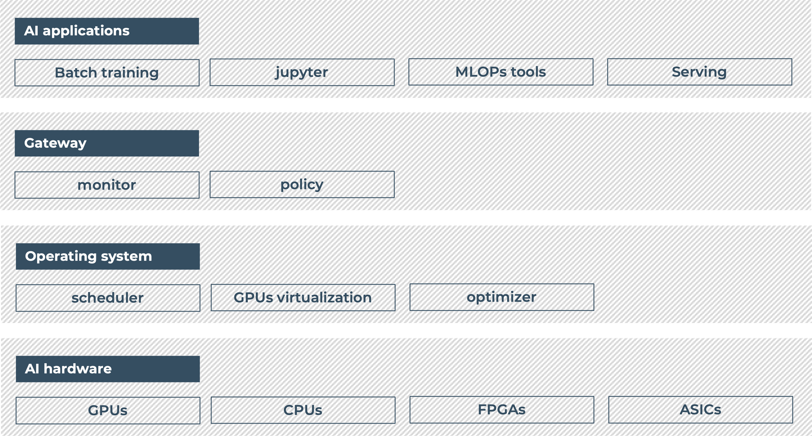

# Nebulnetes (n8s)

The open-source platform for running your AI workloads on Kubernetes maximizing resource utilization.



## Overview

### High-level features

#### Automatic GPU partitioning

Nebulnetes allows you to schedule Pods requesting fractions of GPUs without having to manually partition them:
the partitioning is performed dynamically based on the pending and running Pods in your cluster, so that the GPUs 
are always fully utilized.

> ⚠️ At the moment Nebulnetes only supports [Multi-instance GPU (MIG) partitioning](https://docs.nvidia.com/datacenter/tesla/mig-user-guide/index.html),
> which is available only for NVIDIA GPUs based on Ampere and Hopper architectures.

You can enable a node for automatic GPU partitioning by labeling it with `n8s.nebuly.ai/auto-mig-enabled: "true"`. You 
can then just submit Pods requesting MIG resources (like for instance `nvidia.com/mig-1g.5gb`), and Nebulnetes takes 
care of finding and applying the best possible MIG geometry for providing the requested resources.

#### Elastic resource quota management

Nebulnetes extends the Kubernetes [Resource Quotas](https://kubernetes.io/docs/concepts/policy/resource-quotas/)
by implementing the [Capacity Scheduling KEP](https://github.com/kubernetes-sigs/scheduler-plugins/blob/master/kep/9-capacity-scheduling/README.md) 
and adding more flexibility through two custom resources: `ElasticQuotas` and `CompositeElasticQuotas`.

While standard Kubernetes resource quotas allow you only to define limits on the maximum
overall resource allocation of each namespace, Nebulnetes elastic quotas let you define two
different limits:

1. `min`: the minimum resources that are guaranteed to the namespace
2. `max`: the upper bound of the resources that the namespace can consume

In this way namespaces can borrow reserved resource quotas from other namespaces that are not using them,
as long as they do not exceed their max limit (if any) and the namespaces lending the quotas do not need them.
When a namespace claims back its reserved `min` resources, pods borrowing resources from other namespaces (e.g.
over-quota pods) are preempted to make up space.

Moreover, while the standard Kubernetes quota management computes the used quotas as the aggregation of the resources 
of the resource requests specified in the Pods spec, Nebulnetes computes the used quotas by taking into account 
only running Pods in order to avoid lower resource utilization due to scheduled Pods that failed to start.

## Getting started with Elastic Resource Quotas

### Prerequisites

* it is recommended to have [cert-manager](https://cert-manager.io/docs/installation/) installed on your cluster in
  order to automatically manage the SSL certificates of the HTTP endpoints of the webhook used for validating the
  custom resources. You can install it on your k8s cluster by running `make install-cert-manager``. Alternatively, you 
  can manually create the SSL certificates and inject them in the n8s operator controller manager. 

### Installation
You can install Elastic Resource Quotas management in your cluster running the two Makefile 
targets described below, which install and deploy the required resources to the k8s cluster
specified in your `~/.kube/config`.

1. Deploy the Nebulnetes operator: the target installs the custom resource definitions (CRDs) and 
it deploys the controllers for managing them.

```bash
make deploy-operator
```

2. Deploy the Nebulnetes scheduler. The target deploys a Kubernetes scheduler that runs alongside the
default one and schedules Pods which specify its profile name in the "schedulerName"
field of their specification. If you want to deploy the Nebulnetes scheduler as the default scheduler of
your cluster, you can refer to [documentation](doc/elastic-quota.md) for detailed installation instructions.

```bash
make deploy-scheduler
```

### Create elastic quotas
```yaml
apiVersion: n8s.nebuly.ai/v1alpha1
kind: ElasticQuota
metadata:
  name: quota-a
  namespace: team-a
spec:
  min:
    cpu: 2
    n8s.nebuly.ai/gpu-memory: 16
  max:
    cpu: 10
```
The example above creates a quota for the namespace ``team-a``, guaranteeing it 2 CPUs and 16 GB of GPU memory, 
and limiting the maximum number of CPUs it can use to 10. Note that:
* the ``max`` field is optional. If it is not specified, then the Elastic Quota does not enforce any upper limits on the 
amount resources that can be created in the namespace
* you can specify any resource you want in ``max`` and ``min`` fields

For more details please refer to the [Elastic Resource Quota](doc/elastic-quota.md) documentation page.

### Create Pods subject to Elastic Resource Quota 
Unless you deployed the Nebulnetes scheduler as the default scheduler for your cluster, you need to instruct Kubernetes 
to use it for scheduling the Pods you want to be subject to Elastic Resource Quotas. 

You can do that by setting the value of the `schedulerName` field of your Pods specification to `n8s-scheduler`, as shown in the 
example below.
```yaml
apiVersion: v1
kind: Pod
metadata:
  name: my-pod
spec:
  schedulerName: n8s-scheduler
  containers:
    - name: nginx
      image: nginx:1.14.2
      ports:
        - containerPort: 80
```

## Getting started with automatic GPU partitioning

### Prerequisites

* you need the [NVIDIA GPU Operator](https://github.com/NVIDIA/gpu-operator) deployed on your cluster, configured to 
  use the `mixed` MIG strategy
* you need at least one node with a GPU supporting [MIG](https://www.nvidia.com/en-us/technologies/multi-instance-gpu/)
* if a node has multiple GPUs, all the GPUs must be of the same model

For further information regarding NVIDIA MIG and its integration with Kubernetes, please refer to the
[NVIDIA MIG User Guide](https://docs.nvidia.com/datacenter/tesla/pdf/NVIDIA_MIG_User_Guide.pdf) and to the
[MIG Support in Kubernetes](https://docs.nvidia.com/datacenter/cloud-native/kubernetes/mig-k8s.html)
official documentation provided by NVIDIA.

### Installation
You can install the automatic GPU partitioning components by running the Makefile targets below, which deploys them
required to the k8s cluster specified in your `~/.kube/config`.


1. Deploy the Nebulnetes operator
```shell
make deploy-operator
```

2. Deploy the GPU Partitioner
```shell
make deploy-gpu-partitioner
```

3. Deploy the MIG Agent
```shell
make deploy-mig-agent
```

The targtes above deploy the components using their default configuration. If you want to customize their configuration,
you can refer to the [GPU Partitioner Configuration](doc/gpu-partitioner.md#configuration) page for more information.

### Enable nodes for automatic partitioning

You can make a node eligible for automatic MIG partitioning by following the two steps
described below.

#### 1. Enable MIG on the GPUs of the node

SSH to the node and run the following command for each GPU for which you want to enable MIG,
where `<index>` correspond to the index of the GPU you want to enable:

```shell
sudo nvidia-smi -i <index> -mig 1
```

Depending on the kind of machine you are using, it may be necessary to reboot the node.

#### 2. Enable automatic MIG partitioning

Add the following label to the node in order to let Nebulnetes automatically change the MIG geometry of its GPUs:

```shell
n8s.nebuly.ai/auto-mig-enabled: "true"
```

## Where to go from here

### Documentation

* [MIG GPU Partitioner](doc/gpu-partitioner.md)
* [Elastic resource quota](doc/elastic-quota.md)

### Developer

* [Overview](doc/developer/overview.md)
* [Contributing to Nebulnetes]()
* [Roadmap]()

